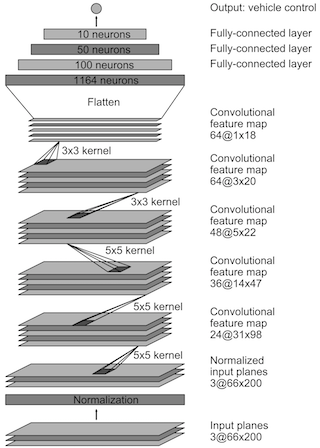
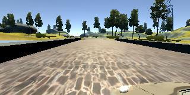
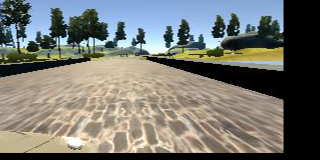

# Project 3: Behavioral Cloning
This document describes the submission for **Project 3: Behavioral Cloning**.

## Table of Contents

- [Approach](#approach)

- [Data Set](#data-set)

- [Convnet Architecture](#convnet-architecture)

- [Training](#training)

- [Results](#results)

- [Supporting Files](#supporting-files)

## Approach
Rather than trying to reinvent the wheel, two existing convolutional neural network ('convnet') architectures were considered for this project:

1. Comma.ai's architecture documented in this [code snippet][3], and

2. NVIDIA's architecture documented in this [paper][1].

Initial, *not overly structured*, attempts at training a working model resulted in the comma.ai architecture being dropped because it always resulted in the car crashing within seconds. In addition, not much is known about how comma.ai's architecture works, whereas NVIDIA's architecture is documented quite well. Note: this does *not* mean comma.ai's architecture is inferior to NVIDIA's.

The downside of NVIDIA's model is that it takes quite a lot longer to train because it contains more layers (and thus parameters). It also requires images to be of size 66 by 200 pixels. While that may be an appropriate size for real-life camera images, it may be more than is really needed for computer generated camera images such as the ones produced by the simulator.

After settling on NVIDIA's architecture, a long process of changing hyperparameters such as the batch size, learning rate, preprocessing steps and regularization in a more structured fashion followed.

## Data Set
A significant amount of time was spent collecting training data by driving the car around the track using the keyboard. Based on feedback available on Slack/Confluence, subsequent attempts used an old PS3 controller. After numerous attempts to create a working model, it was decided to eliminate one of the many unknowns: instead of using data collected manually, sample data made available by Udacity was used.

To minimize memory usage, at the cost of increased computational complexity, only the path of each camera image is loaded into memory. The actual images are not loaded until they are needed during training.

In addition to the center camera image, the left and right camera images are also used. This improves the network's ability to recover the car when it veeres off center too much. The steering angle for the left camera image is increased a little to simulate having to turn the steering wheel sharper to the right to recover. Likewise, the steering angle for the right camera image is decreased a little.

Additional data augmentation is performed during training. Alternatively, additional data could have been obtained by manually driving the car around the track. To limit computational complexity (more images increases training time) and avoid human error (e.g. by simply recording car recovery the wrong way), it was decided to initially rely on the provided sample data only.

## Convnet Architecture
The convnet architecture implemented for this project is identical to the one discussed in [NVIDIA's paper][1]. The architecture is shown in the image below:

The architecture is recreated using a number of Keras layers. The output of a call to Keras' `model.summary` function is shown below:

~~~~
____________________________________________________________________________________________________
Layer (type)                     Output Shape          Param #     Connected to                     
====================================================================================================
cropping2d_1 (Cropping2D)        (None, 138, 320, 3)   0           cropping2d_input_1[0][0]         
____________________________________________________________________________________________________
lambda_1 (Lambda)                (None, 66, 200, 3)    0           cropping2d_1[0][0]               
____________________________________________________________________________________________________
lambda_2 (Lambda)                (None, 66, 200, 3)    0           lambda_1[0][0]                   
____________________________________________________________________________________________________
convolution2d_1 (Convolution2D)  (None, 31, 98, 24)    1824        lambda_2[0][0]                   
____________________________________________________________________________________________________
spatialdropout2d_1 (SpatialDropou(None, 31, 98, 24)    0           convolution2d_1[0][0]            
____________________________________________________________________________________________________
convolution2d_2 (Convolution2D)  (None, 14, 47, 36)    21636       spatialdropout2d_1[0][0]         
____________________________________________________________________________________________________
spatialdropout2d_2 (SpatialDropou(None, 14, 47, 36)    0           convolution2d_2[0][0]            
____________________________________________________________________________________________________
convolution2d_3 (Convolution2D)  (None, 5, 22, 48)     43248       spatialdropout2d_2[0][0]         
____________________________________________________________________________________________________
spatialdropout2d_3 (SpatialDropou(None, 5, 22, 48)     0           convolution2d_3[0][0]            
____________________________________________________________________________________________________
convolution2d_4 (Convolution2D)  (None, 3, 20, 64)     27712       spatialdropout2d_3[0][0]         
____________________________________________________________________________________________________
spatialdropout2d_4 (SpatialDropou(None, 3, 20, 64)     0           convolution2d_4[0][0]            
____________________________________________________________________________________________________
convolution2d_5 (Convolution2D)  (None, 1, 18, 64)     36928       spatialdropout2d_4[0][0]         
____________________________________________________________________________________________________
spatialdropout2d_5 (SpatialDropou(None, 1, 18, 64)     0           convolution2d_5[0][0]            
____________________________________________________________________________________________________
flatten_1 (Flatten)              (None, 1152)          0           spatialdropout2d_5[0][0]         
____________________________________________________________________________________________________
dense_1 (Dense)                  (None, 100)           115300      flatten_1[0][0]                  
____________________________________________________________________________________________________
dropout_1 (Dropout)              (None, 100)           0           dense_1[0][0]                    
____________________________________________________________________________________________________
dense_2 (Dense)                  (None, 50)            5050        dropout_1[0][0]                  
____________________________________________________________________________________________________
dense_3 (Dense)                  (None, 10)            510         dense_2[0][0]                    
____________________________________________________________________________________________________
dropout_2 (Dropout)              (None, 10)            0           dense_3[0][0]                    
____________________________________________________________________________________________________
dense_4 (Dense)                  (None, 1)             11          dropout_2[0][0]                  
====================================================================================================
Total params: 252219
~~~~

The convnet contains the following nine layers:

- *Image preprocessing layer*: making image preprocessing part of the network means the `drive.py` file does not have to be changed. Images are:

    * cropped to exclude the area above the horizon (`Cropping2D` layer)
    
    * resized to 66x200 pixels, the image size used by the NVIDIA architecture (`Lambda` layer), and
    
    * normalized (`Lambda` layer).

- *Convolutional layer 1*: 24 5x5 kernels, stride 2

- *Convolutional layer 2*: 36 5x5 kernels, stride 2

- *Convolutional layer 3*: 48 5x5 kernels, stride 2

- *Convolutional layer 4*: 64 5x5 kernels, stride 1

- *Convolutional layer 5*: 64 5x5 kernels, stride 1

- *Fully connected layer 1*: 100 neurons

- *Fully connected layer 2*: 50 neurons

- *Fully connected layer 3*: 10 neurons

The last fully connected layer is connected to a single neuron that contains the predicted steering angle.

### Architecture Deviations
The NVIDIA architecture actually predicts (1/steering angle) rather than the steering angle. This is not implemented for P3. It also converts images to YUV color space during preprocessing. While this was at some point implemented for P3, it did not improve model performance. YUV conversion was therefore droppped in order to minimize computational complexity.

### Overfitting
The NVIDIA paper does not discuss how the architecture was regularized to avoid overfitting. Trial and error resulted in a Keras `SpatialDropout2D` layer being added after each convolutional layer. `SpatialDropout2D` layers perform the same function as Dropout, however they drop entire feature maps instead of individual neurons. A `Dropout` layer was added after the first and third fully connected layer.

## Training
Prior to training, the entire dataset is split into a training (90% of the data) and validation (10% of the data) set. A test set was not used: the ultimate test is to simply run the simulator with the final model and see if the car stays on the track. Also, because the number of available camera images is somewhat limited, it is important to use as much of the data as possible for model training.

### Generator
To avoid memory issues a generator serves minibatches of data to Keras' `model.fit_generator` function. The generator shuffles the entire dataset before the start of each epoch.

### Data Augmentation
The generator also performs data augmentation 'on the fly' as it creates each individual batch. It performs the following steps:

1. read the image and associated steering angle from disk

2. randomly flip the image and steering angle horizontally

3. randomly shift the image up and down and left to right, adjusting the steering angle accordingly

Steps 2 and 3 help the model learn to recover the car when it veers too much to the left or right. It also reduces the number of images with a steering angle of (close to) zero, which reduces the bias of driving straight ahead cause by Track 1 having very few sharp bends. Shifting images up and down improves the model's ability to drive around Track 2, which includes signficant differences in elevation.

An example of an image that has been flipped *and* shifted is shown below:

**Before**:

**After**:

### Loss Function and Optimizer
Because this is essentially a regression problem, the `mse` or Mean Squared Error is used as the loss function, combined with the `Adam` optimizer and a default initial learning rate of 0.001. Model weights are saved at the end of each epoch. This is the poor man's version of early stopping: training is performed using a fixed number of epochs; the model with the lowest validation loss is selected as the final model.

## Results
Training the model for ten epochs took almost 33 minutes on a laptop without a GPU. The average training loss (`loss`) and validation set loss (`val_loss`) for each epoch are shown in the list below:

~~~~
Epoch   1: loss = 0.0252 val_loss = 0.0208
Epoch   2: loss = 0.0229 val_loss = 0.0205 
Epoch   3: loss = 0.0212 val_loss = 0.0177 
Epoch   4: loss = 0.0200 val_loss = 0.0164 
Epoch   5: loss = 0.0180 val_loss = 0.0148 
Epoch   6: loss = 0.0163 val_loss = 0.0130 
Epoch   7: loss = 0.0164 val_loss = 0.0130 
Epoch   8: loss = 0.0155 val_loss = 0.0125
Epoch   9: loss = 0.0154 val_loss = 0.0139 
Epoch  10: loss = 0.0151 val_loss = 0.0128
~~~~

Epoch 8 produced the model with the lowest validation error of 0.0125. Using that model with `drive.py` to drive the car around indeed confirms the car stays on Track 1. Surprisingly, the model generalizes quite well: the car almost finishes Track 2, crashing in one of the last bends. This is somewhat surprising because of the limited number of images in the data set and the rather simplistic data augmentation approach. Also, Track 2 contains much more and sharper bends and significant elevation differences. With more training data and/or more sophisticated data augmentation, the model should be able to drive around Track 2 without crashing.

Interestingly, the models produced by epochs 6, 7 and 10 also resulted in the car driving around Track 1 without crashing. However, only the models produced by epochs 6 and 8 resulted in good (but not perfect) performance on Track 2.

## Supporting Files
All model training code is included in the file `model.py`. The file `drive.py` was provided by Udacity and has not been changed in any way.

[1]: http://images.nvidia.com/content/tegra/automotive/images/2016/solutions/pdf/end-to-end-dl-using-px.pdf "NVIDIA's paper"
[2]: https://medium.com/@vivek.yadav/using-augmentation-to-mimic-human-driving-496b569760a9#.faqcxa6ap "Fellow student Vivek Medium post"
[3]: https://github.com/commaai/research/blob/master/train_steering_model.py "Comma.ai's network"
